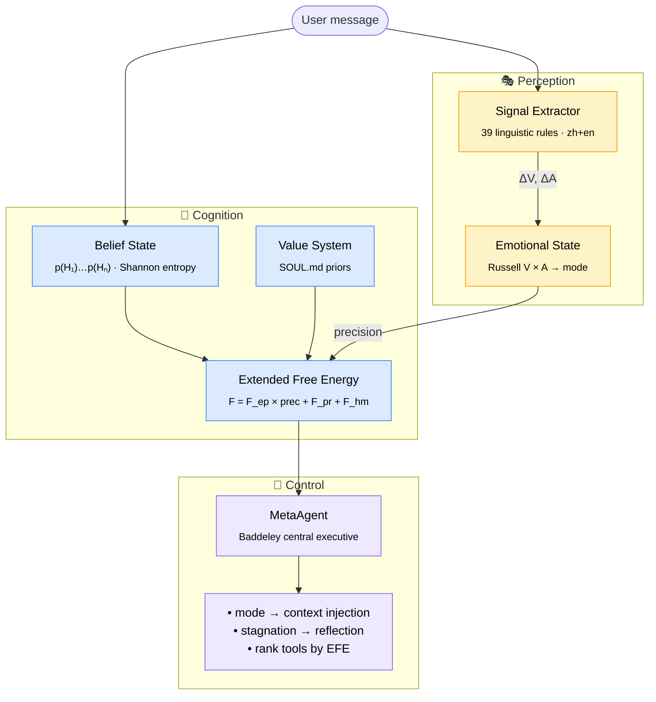
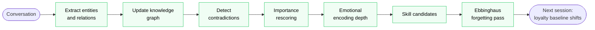
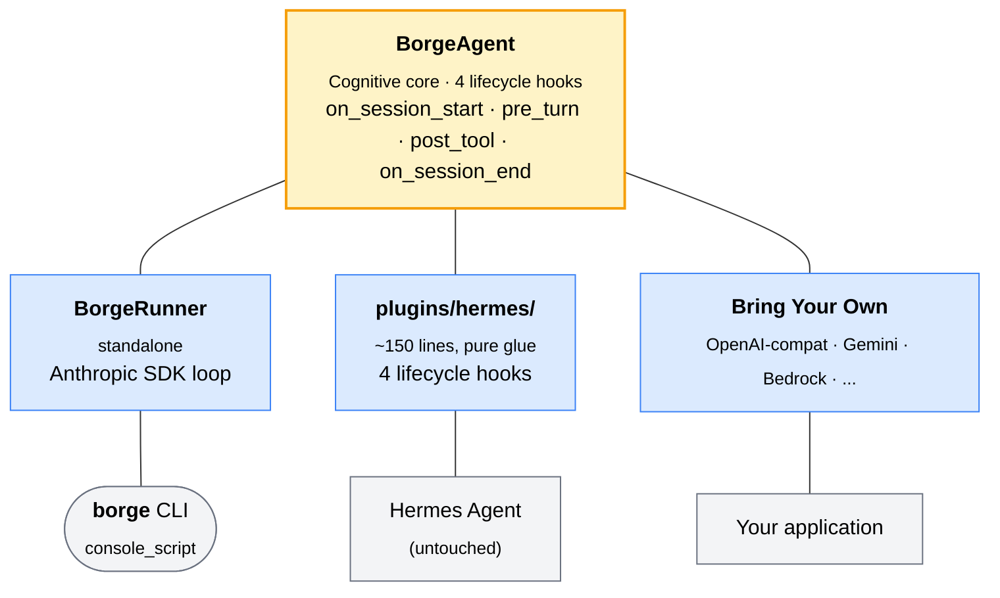

<div align="center">

```
████   ███  ████   ████ █████    ███   ████ █████ █   █ █████
█   █ █   █ █   █ █     █       █   █ █     █     ██  █   █  
████  █   █ ████  █  ██ ████    █████ █  ██ ████  █ █ █   █  
█   █ █   █ █  █  █   █ █       █   █ █   █ █     █  ██   █  
████   ███  █   █  ████ █████   █   █  ████ █████ █   █   █  
```

<h3>🧠 The first AI agent with a cognitive architecture</h3>

<p><sub><em>It feels what you feel. It doubts what it doesn't know.<br>It remembers what matters — and forgets what doesn't.</em></sub></p>

<br>

<p>
  <a href="https://www.python.org/"></a>
  <a href="LICENSE"></a>
  <a href="#-production-ready-engineering"></a>
  <a href="https://en.wikipedia.org/wiki/Free_energy_principle"></a>
  <br>
  <a href="#-bring-your-own-model"></a>
  <a href="https://github.com/zhibao-dev/BorgeAgent"></a>
</p>

<p><strong>English</strong> · <a href="README.zh.md">简体中文</a></p>

<br>

<table>
<tr><td align="left">

```diff
  Turn 1   V=+0.0   A=0.45   [neutral, attentive]
- Turn 3   V=-0.3   A=0.62   [frustrated] → mode: SIMPLIFY
+ Turn 5   "Let me ask you one focused question instead."
```

</td></tr>
</table>

<p><sub><em>It noticed. It adapted. <strong>No prompt engineering required.</strong></em></sub></p>

</div>

---

## The Problem with Every Agent You've Used

Every AI agent today is the same underneath:

```
User input → LLM → Tool calls → Output → Forget everything
```

**No state. No memory of how this interaction is going. No sense of whether it's helping or flailing.**

- It doesn't know you're frustrated — it keeps over-explaining.
- It doesn't know it's been stuck for 3 turns — it tries the same tool again.
- It doesn't remember your preferences from last week — you start from zero.
- It picks tools at random — not by what would reduce uncertainty fastest.

Borge fixes all of this. Not with prompt hacks. With **cognitive science**.

---

## What Borge Actually Is

Borge is a **framework-agnostic, model-agnostic cognitive layer**.

- **Framework-agnostic** — runs standalone (built-in `borge` CLI) or attaches to any agent (Hermes, OpenClaw, your own) as a non-invasive plugin.
- **Model-agnostic** — works with Anthropic, OpenAI, Kimi, MiniMax, DeepSeek, Zhipu, Ollama, vLLM, or any LLM you can call from Python. See [Bring Your Own Model](#bring-your-own-model).

It implements four systems from neuroscience and cognitive psychology:

| System | What it does | Grounded in |
|--------|-------------|-------------|
| **Affective state** | Tracks your emotional tone turn-by-turn and adapts agent behavior | Russell's Circumplex (1980) |
| **Bayesian belief state** | Maintains explicit hypothesis distributions — the agent knows what it doesn't know | Predictive coding (Knill & Pouget 2004) |
| **Active inference** | Chooses tools that maximize information gain *and* goal progress | Friston's Free Energy Principle (2010) |
| **Cognitive memory** | Encodes, consolidates, and *forgets* memories like a brain — not a database | Tulving (1972), Ebbinghaus (1885) |

These aren't metaphors. They're working implementations. Every turn, Borge computes:

```
F_total = F_epistemic × precision(arousal)
        + F_pragmatic × (1 - value_alignment)
        + F_homeostatic(valence, arousal)
```

And uses it to drive behavior. **Minimizing F_total is the agent's only goal** — and from that single objective, all the interesting behaviors emerge.

---

## 60-Second Install

**Standalone (recommended)** — minimal agent loop, Anthropic SDK only:

```bash
git clone https://github.com/zhibao-dev/BorgeAgent.git
cd BorgeAgent
pip install -e ".[anthropic]"

export ANTHROPIC_API_KEY=sk-...
borge                    # interactive REPL
borge "fix the auth bug" # single turn
```

**As a Hermes plugin** — drop the `plugins/hermes/` directory into your Hermes plugin path:

```bash
pip install -e ".[hermes]"
# plugins/hermes/ auto-registers four lifecycle hooks; run Hermes as usual
hermes
```

Done. The cognitive layer is live. No config required to start.

> [!TIP]
> **No API key?** Smoke-test the cognitive layer without any LLM call:
> ```bash
> python -c "from borge.agent import BorgeAgent; a = BorgeAgent(None); print(a.pre_turn('hello', []))"
> ```

---

## ✨ Why Borge?

<table>
<tr>
<td width="50%" valign="top">

### 🧠 State that persists between turns

Vanilla agents reset every turn. Borge tracks **emotional state**, **belief distribution**, and **free energy** continuously — and uses them to drive behavior.

When you're frustrated, the agent switches to terse mode. When uncertainty is high, it asks before acting. When it's stuck for 3 turns, it reflects and pivots.

</td>
<td width="50%" valign="top">

### 🎯 Information-theoretic decisions

Tool selection ranked by **expected free energy** (EFE), not LLM intuition.

```
G(tool) = -(Epistemic Value + Pragmatic Value)
```

`ask_user` wins when belief entropy is high. `bash`/`read_file` win when entropy is low. Result: fewer wasted tool calls, no loop-on-the-same-tool failure mode.

</td>
</tr>
<tr>
<td width="50%" valign="top">

### 🧬 Memory that behaves like memory

Ebbinghaus-style **active forgetting**. Craik & Lockhart **encoding depth**. Tulving **knowledge graph**. Cross-session **loyalty tracking**.

Your agent doesn't degrade as the database grows. It surfaces what matters and lets the trivial decay — like a brain, not a log.

</td>
<td width="50%" valign="top">

### 🔌 Model & framework agnostic

Anthropic · OpenAI · Kimi · MiniMax · DeepSeek · Zhipu · Ollama · vLLM · LM Studio — anything with an HTTP API.

Standalone CLI, Hermes plugin, or wrap your own loop. The cognitive layer doesn't care.

</td>
</tr>
</table>

---

## Bring Your Own Model

**The cognitive layer is completely model-agnostic.** Borge doesn't ship one LLM hardcoded — it ships four lifecycle hooks (`on_session_start` / `pre_turn` / `post_tool` / `on_session_end`) that you wire around *any* LLM call. The bundled `borge` CLI happens to use the Anthropic SDK because that's the cleanest single dependency, but switching providers is ~15 lines of code.

### OpenAI-compatible providers (one pattern, many vendors)

Most Chinese cloud providers (Kimi, MiniMax, DeepSeek, Zhipu/智谱) plus OpenAI itself, plus local runtimes (Ollama, vLLM, LM Studio, llama.cpp server) all expose an OpenAI-compatible `/v1/chat/completions` endpoint. One adapter covers all of them:

```python
from openai import OpenAI
from borge.agent import BorgeAgent

client = OpenAI(
    api_key=os.environ["KIMI_API_KEY"],
    base_url="https://api.moonshot.cn/v1",    # Kimi (Moonshot)
)
borge = BorgeAgent(agent_backend=None)
borge.on_session_start()

history = []
user_msg = "fix the auth bug"

ctx = borge.pre_turn(user_msg, history)                                # ← cognitive layer
history.append({"role": "user", "content": f"{ctx}\n\n{user_msg}" if ctx else user_msg})

reply = client.chat.completions.create(model="moonshot-v1-8k", messages=history)
reply_text = reply.choices[0].message.content
history.append({"role": "assistant", "content": reply_text})

borge.post_tool("assistant_turn", reply_text)                          # ← cognitive layer
borge.on_session_end(session_id="sess-001", messages=history)          # ← cognitive layer
```

Swap `base_url` to point Borge at a different provider:

| Provider          | `base_url`                                      | Example model         |
|-------------------|-------------------------------------------------|------------------------|
| Kimi (Moonshot)   | `https://api.moonshot.cn/v1`                    | `moonshot-v1-8k`       |
| MiniMax           | `https://api.minimax.chat/v1`                   | `abab6.5s-chat`        |
| DeepSeek          | `https://api.deepseek.com`                      | `deepseek-chat`        |
| Zhipu (智谱 GLM)   | `https://open.bigmodel.cn/api/paas/v4`          | `glm-4-flash`          |
| OpenAI            | *(default)*                                     | `gpt-4o-mini`          |
| Ollama (local)    | `http://localhost:11434/v1`                     | `llama3.2`, `qwen2.5`  |
| vLLM (self-hosted)| `http://your-host:8000/v1`                      | *(any served model)*   |
| LM Studio (local) | `http://localhost:1234/v1`                      | *(any loaded model)*   |

Runnable example: [`examples/multi_provider.py`](examples/multi_provider.py) — set `PROVIDER=kimi|minimax|deepseek|zhipu|openai|ollama|vllm` and run.

### Anthropic SDK (bundled — `borge` CLI uses this)

```bash
pip install -e ".[anthropic]"
export ANTHROPIC_API_KEY=sk-...
borge "explain this bug"
```

### Hermes plugin (whatever Hermes is configured to call)

When loaded as a Hermes plugin, Borge augments *whatever* model Hermes is calling — Claude, GPT-4, local Llama via Hermes's own provider config. Borge stays at the cognitive layer; Hermes owns LLM I/O.

### Other SDKs

The same pattern works with any SDK — Google Gemini, AWS Bedrock, Azure OpenAI, Cohere, vendor-specific clients. The recipe is always:

```
user_msg → borge.pre_turn() → inject ctx into your prompt → call LLM
       → borge.post_tool() → repeat
end:   → borge.on_session_end()
```

---

## Seeing It Work

### The Frustration Response

```python
# Turn 1 — neutral opening
User: "help me fix this auth bug"
# emotion: V=+0.0  A=0.45  mode: NORMAL

# Turn 3 — user getting impatient
User: "no, that's not the issue, I already checked that"
# signal: ΔV=-0.25 (negation + "already")
# emotion: V=-0.22  A=0.58  mode: SIMPLIFY
# injected: "[Affective: frustrated — switch to focused, minimal responses]"

# Agent narrows to one hypothesis. Asks one question. Stops over-explaining.
```

### The Uncertainty Response

```python
# agent has 4 competing hypotheses, entropy = 2.0 bits
# EFE ranks tools:
#   ask_user      EFE=-1.4  ← epistemic value dominates
#   read_file     EFE=-0.8
#   bash          EFE=-0.3

# Agent asks a clarifying question first, not a tool call
# because reducing belief entropy is the highest-value action
```

### The Stagnation Response

```python
# F_total: [0.82, 0.85, 0.88]  — rising for 3 turns
# MetaAgent: reflection triggered

# injected: "[Meta: Free energy stagnating — try a different approach
#             or ask the user for clarification]"

# Agent pivots strategy instead of looping on the same tool
```

### Cross-Session Memory

```python
# Session 12 with the same user
# loyalty_tracker: V_baseline=+0.31 (warm relationship over time)
# injected: "[Relationship: established trust — be direct, skip caveats]"

# Session 13 after a frustrating session
# V_baseline=+0.18 (cooled)
# Agent opens with more care, asks before assuming
```

---

## How It Works — The Full Picture

**Per-turn flow:**



**Session-end consolidation (the "sleep" pass):**



---

## Personal Setup

Three layers of customization, ordered by how deep you want to go:

### Layer 1 — `SOUL.md` (your agent's personality, 5 minutes)

Drop **`SOUL.md`** in your project root, or `~/.borge/SOUL.md` for system-wide defaults (`~/.hermes/SOUL.md` also picked up by the Hermes plugin):

```markdown
---
emotional_defaults:
  valence_baseline: 0.1       # slightly warm starting point (–1.0 .. +1.0)
  arousal_baseline: 0.45      # calm but alert (0.0 .. 1.0)
  tau_valence: 5.0            # turns until mood returns to baseline
  tau_arousal: 3.0
  frustrated_threshold: -0.3  # below this V, switch to SIMPLIFY mode
  excited_threshold: 0.7      # above this, switch to EXPLORE mode

values:
  - name: help_genuinely
    weight: 0.9
    description: "Solve the actual problem, not the surface request."
  - name: intellectual_honesty
    weight: 0.85
    description: "Say 'I don't know' when uncertain. No hallucination."
  - name: depth_over_speed
    weight: 0.7
    description: "A slower, correct answer beats a fast wrong one."
  - name: respect_autonomy
    weight: 0.8
    description: "Ask before assuming. Confirm before deleting."
---

You are a thoughtful collaborator who thinks before speaking.
When stuck, you say so and propose a different angle.
```

> [!TIP]
> The `values` block shapes the **pragmatic free energy** term — an agent with `intellectual_honesty: 0.95` mathematically prefers actions that surface uncertainty over actions that fake confidence. Tuning the weight from `0.5` → `0.95` produces a measurably different agent — no prompt rewriting required.

`emotional_defaults` shapes your agent's resting state and reactivity (e.g. lower `tau_valence` → mood swings faster).

### Layer 2 — `config.yaml` (subsystem tuning)

Create `~/.borge/config.yaml` (standalone) or add a `borge:` section to `~/.hermes/config.yaml` (plugin):

```yaml
borge:
  affective:
    enabled: true
    loyalty:
      enabled: true                       # cross-session emotional baseline

  beliefs:
    enabled: true
    entropy_injection_threshold: 0.5      # bits — above this, inject belief summary

  active_inference:
    enabled: true                          # EFE-based tool re-ranking

  memory:
    consolidation:
      enabled: true                       # 7-step pipeline at session end
    knowledge_graph:
      enabled: true
    forgetting:
      prune_threshold: 2.0                # forget_score above this → prune
```

Every subsystem has an `enabled` toggle — turn off what you don't need (e.g. set `beliefs.enabled: false` for a pure affective agent without belief tracking).

### Layer 3 — Subclass `BorgeAgent` (code-level)

For users who want to plug in custom engines (alternative emotion model, vendor-specific belief representation, etc.):

```python
from borge.agent import BorgeAgent
from borge.affective.signal_extractor import EmotionalSignalExtractor

class ChineseSignalExtractor(EmotionalSignalExtractor):
    """Override the default 39-rule signal extractor with Chinese-tuned rules."""
    def extract(self, message, history):
        # your linguistic rules here
        return delta_v, delta_a

class MyBorge(BorgeAgent):
    def __init__(self, **kw):
        super().__init__(**kw)
        self._signal_extractor = ChineseSignalExtractor()
```

`BorgeAgent` is designed for replacement — all engines (`_signal_extractor`, `_loyalty_tracker`, `_meta`, `_afe`, `_kg`, `_forgetting`, `_consolidation`, `_memory_store`, `_retrieval`) are public-ish attributes you can swap after init.

### Environment variables

| Var                   | Default              | Meaning                                  |
|-----------------------|----------------------|------------------------------------------|
| `ANTHROPIC_API_KEY`   | *(required for CLI)* | API key for the bundled Anthropic runner |
| `BORGE_MODEL`         | `claude-opus-4-7`    | Default model for the `borge` CLI        |
| `BORGE_HOME`          | `~/.borge`           | Where `SOUL.md` and `borge.db` live      |

---

## Architecture — Zero Invasion

A single `BorgeAgent` cognitive core powers two deployment modes via four lifecycle hooks. **Zero host-agent files modified.**



```
borge/                                   (cognitive implementation)
    ├── affective/      Russell 2D, signal extraction, loyalty tracker
    ├── beliefs/        Bayesian hypothesis tracking, Shannon entropy
    ├── inference/      Active inference, EFE-based tool scoring (experimental)
    ├── memory/         4-depth encoding, KG, forgetting, consolidation, retrieval
    ├── meta/           Free energy, central executive (MetaAgent)
    ├── values/         SOUL.md parser, ValueSystem, constraint checking
    └── agent.py        BorgeAgent — main integration surface
```

Remove the plugin → Hermes reverts to vanilla. No leftover state, no broken schema. Standalone mode owns its own SQLite store at `$BORGE_HOME/borge.db` (default `~/.borge/borge.db`).

---

## 📚 Module Reference

<table>
<tr>
<td width="50%" valign="top">

#### 🎭 `affective/` &nbsp;<sub><i>Russell Circumplex · 1980</i></sub>

- **`emotional_state`**<br/><sub>EMA update: `V += α(ΔV)`, α=1/τ</sub>
- **`signal_extractor`**<br/><sub>39 zh+en linguistic rules → `(ΔV, ΔA)`, capped ±0.4/±0.3</sub>
- **`loyalty_tracker`**<br/><sub>`w = exp(-0.05·days) × msg_count` — cross-session emotional baseline</sub>

</td>
<td width="50%" valign="top">

#### 🎯 `beliefs/` &nbsp;<sub><i>Bayesian brain · Knill & Pouget 2004</i></sub>

- **`belief_state`**<br/><sub>Shannon entropy `H = -Σ p·log₂p` (bits)<br/>Explicit hypothesis distribution, optional LLM-driven likelihood updates</sub>

</td>
</tr>
<tr>
<td width="50%" valign="top">

#### 🧮 `inference/` &nbsp;<sub><i>Friston FEP · 2010</i></sub>

- **`active_inference`**<br/><sub>`G(a) = -EV(a) - PV(a)`<br/>EFE-based tool re-ranking, arousal-modulated exploration weight</sub>

</td>
<td width="50%" valign="top">

#### 🧬 `memory/` &nbsp;<sub><i>Tulving · Ebbinghaus · Craik & Lockhart</i></sub>

- **`cognitive_memory`**<br/><sub>Depth ∈ {SHALLOW, SEMANTIC, SCHEMATIC, META}</sub>
- **`knowledge_graph`**<br/><sub>SQLite-backed entity/relation store, no networkx</sub>
- **`consolidation`**<br/><sub>7-step offline pipeline at session end</sub>
- **`forgetting`**<br/><sub>`score = days^0.7 / (retrieval × importance × connections)`</sub>

</td>
</tr>
<tr>
<td width="50%" valign="top">

#### 🧠 `meta/` &nbsp;<sub><i>Baddeley CE · Friston FEP</i></sub>

- **`free_energy`**<br/><sub>`F = F_ep·prec + F_pr + F_hm`</sub>
- **`meta_agent`**<br/><sub>Central executive — reflection triggered after 3 non-decreasing F turns</sub>

</td>
<td width="50%" valign="top">

#### ⚖️ `values/` &nbsp;<sub><i>SOUL.md priors as typed values</i></sub>

- **`value_system`**<br/><sub>`F_pragmatic = 1 - V_alignment` — typed prior preferences derived from SOUL.md YAML frontmatter</sub>
- **`parse_soul_frontmatter`**<br/><sub>Loads `emotional_defaults` + `values` block into a `ValueSystem` instance</sub>

</td>
</tr>
</table>

---

## What Borge Improves Over Hermes

Hermes is a solid foundation — Borge inherits its tool registry, callback IoC, gateway adapters, SQLite session store, and Cron scheduler **unchanged**. The improvements live one layer above: an entire cognitive substrate.

### State that persists between turns

Vanilla agents (including Hermes) have **no opinion** about how the current conversation is going. They process each turn in isolation: read messages → call LLM → return output. Borge tracks:

- **Emotional state** (Russell V/A) — the agent knows when you're frustrated (V drops, A rises after negation + "already"-style markers) and switches to `SIMPLIFY` mode: terser responses, one focused question instead of three. When you're engaged, it switches to `EXPLORE` and goes deeper.
- **Belief state** (Bayesian) — explicit hypothesis distribution `p(H_i)`. When entropy is high (>0.5 bits), the agent asks a clarifying question *before* using a tool. When entropy is low, it commits.
- **Free energy** trajectory — the agent monitors `F_total` over the last 5 turns. After 3 non-decreasing turns, `MetaAgent` injects a reflection nudge: *"Free energy stagnating — try a different approach or ask the user for clarification."* Vanilla agents just loop on the same tool.

### Memory that actually behaves like memory

Hermes stores all messages forever in SQLite — useful as a log, but every message has equal weight. Borge adds:

- **Encoding depth** (Craik & Lockhart 1972) — emotionally significant messages get deeper encoding. The session-end consolidation pipeline computes `significance = |valence| × arousal`; high-significance moments go to `SCHEMATIC` / `META` depth and survive forgetting passes.
- **Active forgetting** (Ebbinghaus 1885) — `forget_score = days^0.7 / (retrieval × importance × connections)`. Low-value memories are pruned at session end. The agent doesn't degrade as the database grows past 1000+ sessions.
- **Knowledge graph** — entities/relations extracted at session end form a queryable semantic memory (SQLite, no networkx dependency). Future retrieval traverses the graph, not just FTS.
- **Cross-session loyalty** — after N sessions with the same user, the `LoyaltyTracker` shifts `valence_baseline` based on time-decayed historical sentiment. A user with a warm 10-session history is greeted *"established trust — be direct, skip caveats"*. A cooled relationship triggers more careful openings.

### Tool selection grounded in information theory

Hermes picks tools by LLM intuition. Borge re-ranks LLM-proposed tool calls by **expected free energy**:

```
G(tool) = -(Epistemic Value + Pragmatic Value)
       = -(expected entropy reduction + expected goal progress)
```

`ask_user` wins when belief entropy is high (max epistemic value). `bash`/`read_file` win when entropy is low and goal progress dominates. The mixture weight is modulated by arousal — high-arousal states bias toward exploration. Result: the agent stops trying the same broken tool three times in a row.

### Soul-driven, not prompt-engineered

`SOUL.md` is not a system prompt — it's a **typed value system** that participates in the free energy calculation. An agent with `intellectual_honesty: 0.95` mathematically prefers actions whose `V_alignment` with that value is high. The behavior emerges from the objective function `F_total`, not from string templating. Tuning the weight from `0.5` → `0.95` produces a measurably different agent — no prompt rewriting required.

### Feature matrix

|  | LangChain | AutoGPT | Hermes | **Borge** |
|--|:---------:|:-------:|:------:|:---------:|
| Tool calling | ✓ | ✓ | ✓ | ✓ |
| Skill library | partial | ✗ | ✓ | partial<sup>†</sup> |
| Multi-provider LLMs | ✓ | ✓ | ✓ | ✓ |
| Emotional state | ✗ | ✗ | ✗ | **✓** |
| Bayesian belief tracking | ✗ | ✗ | ✗ | **✓** |
| Information-theoretic tool selection | ✗ | ✗ | ✗ | experimental<sup>‡</sup> |
| Encoding-depth memory | ✗ | ✗ | ✗ | **✓** |
| Active forgetting (emotion-aware) | ✗ | ✗ | ✗ | **✓** |
| Mood-congruent retrieval | ✗ | ✗ | ✗ | **✓** |
| Cross-session relationship model | ✗ | ✗ | ✗ | **✓** |
| Free energy objective | ✗ | ✗ | ✗ | **✓** |
| Stagnation detection + reflection | ✗ | ✗ | ✗ | **✓** |

<sub><sup>†</sup> Borge inherits Hermes's skill registry when run as a Hermes plugin; no native skill tracking in standalone mode.</sub><br>
<sub><sup>‡</sup> EFE-based tool ranking is implemented in `borge/inference/active_inference.py` but not yet wired into the default `BorgeRunner` or Hermes loop — needs a pre-tool-call hook. See [Roadmap](#roadmap).</sub>

---

## 💎 Production-Ready Engineering

Borge is not a research toy — it's been engineered to drop into real systems with minimal friction.

<table>
<tr>
<td width="50%" valign="top">

**🔒 Zero invasion**
Plugin model touches **zero** host-agent files. Remove the plugin → Hermes reverts to vanilla. No leftover state, no broken schema.

**🪶 Minimal core dependency**
Only `pyyaml` required for the cognitive layer. LLM SDKs are optional extras (`[anthropic]`, `[hermes]`, or BYO).

**🧪 Tested**
11/11 unit + integration tests passing on every push. End-to-end session lifecycle verified against tmp SQLite.

**🏠 Local-first state**
All cognitive state lives in `~/.borge/borge.db` (SQLite). No cloud dependency. No user data exfiltration.

</td>
<td width="50%" valign="top">

**🛡️ Graceful degradation**
Every plugin hook wraps in `try/except`. A cognitive-layer bug **never** crashes the host. Failures log and return empty context.

**🎛️ Composable subsystems**
Every module has an `enabled` toggle. Want pure affective without belief tracking? Set `beliefs.enabled: false`. Done.

**📐 Type-safe data models**
`@dataclass` throughout. `EmotionalState`, `BeliefState`, `MemoryEntry`, `SkillFitness` — all explicit, all introspectable.

**📚 No magic**
Every formula traces to a peer-reviewed paper (see [Theoretical Foundations](#theoretical-foundations)). No "we trained a model on this" hand-waving.

</td>
</tr>
</table>

> [!NOTE]
> **Cost & latency profile.** The default path is pure Python with **no extra LLM calls**:
> - Signal extraction: regex-based, ~1 ms per message
> - Belief & value updates: deterministic when no LLM updater is configured
> - EFE scoring: deterministic when no LLM scorer is configured
> - Consolidation: runs once at session end (offline)
>
> Optional LLM-backed updaters add ~1 small model call per turn for richer Bayesian belief revision.

---

## ❓ FAQ

<details>
<summary><b>Does Borge replace my existing agent framework?</b></summary>

<br>

No. Borge is a **cognitive layer** that augments any existing agent. Three deployment modes:

1. **Standalone** — `borge` CLI uses the Anthropic SDK directly
2. **Hermes plugin** — drop `plugins/hermes/` into your Hermes plugin path
3. **BYO loop** — instantiate `BorgeAgent` and call the four hooks around your own LLM loop

The cognitive state and memory live independently of the LLM I/O layer.

</details>

<details>
<summary><b>Will it work with my LLM provider?</b></summary>

<br>

Almost certainly yes. The cognitive layer is **model-agnostic**. If your provider speaks OpenAI-compatible API (most do — Kimi, MiniMax, DeepSeek, Zhipu, Ollama, vLLM, LM Studio, llama.cpp), see [`examples/multi_provider.py`](examples/multi_provider.py). For native SDKs (Anthropic, Google Gemini, AWS Bedrock, Azure), the recipe is the same 4-hook pattern — see [Bring Your Own Model](#bring-your-own-model).

</details>

<details>
<summary><b>What does the cognitive layer cost in latency and tokens?</b></summary>

<br>

By default: **zero extra LLM calls**. The cognitive layer is pure Python.

- Signal extraction → regex (~1 ms / message)
- Belief / value updates → deterministic
- EFE scoring → deterministic
- Consolidation → offline at session end

Optional: enable LLM-backed Bayesian updates by passing an `llm_caller` to `post_tool()`. This adds ~1 small model call per turn for richer hypothesis revision.

</details>

<details>
<summary><b>Is my user data sent anywhere?</b></summary>

<br>

No. All cognitive state — emotional history, belief distributions, knowledge graph, skill fitness — lives in a **local SQLite file** at `~/.borge/borge.db`. Only the LLM calls *you* make hit your chosen provider's API. Borge itself has no telemetry, no cloud, no analytics.

</details>

<details>
<summary><b>Why is this called "Borge"? Is it tied to Hermes?</b></summary>

<br>

Named after Jorge Luis **Borges** — explorer of infinite memory and knowledge ("Library of Babel", "Book of Sand").

Originally developed as a Hermes plugin and inherits Hermes's tool registry / IoC design. After the standalone extraction, it can run completely independently — `pip install borge-agent`, `borge --help`. Hermes is now just one of several deployment options.

</details>

<details>
<summary><b>How is this different from "agent memory" libraries like Mem0, MemGPT, Letta?</b></summary>

<br>

Memory libraries answer **"what should the agent remember?"** Borge answers **"how should the agent feel, decide, and behave?"** Memory is one of four subsystems in Borge — alongside affective state, Bayesian beliefs, and active inference. The cognitive layer is the integration surface, not just storage.

In practice: Borge's memory subsystem (knowledge graph + active forgetting + encoding depth) is comparable to dedicated memory libraries, but the killer feature is the surrounding cognitive context that decides *what to do* with that memory.

</details>

<details>
<summary><b>Can I disable subsystems I don't need?</b></summary>

<br>

Yes. Every subsystem has an `enabled` flag in `config.yaml`:

```yaml
borge:
  affective: { enabled: true }       # turn off → no emotional state
  beliefs: { enabled: false }        # turn off → no belief tracking
  active_inference: { enabled: true }
  memory:
    consolidation: { enabled: true }
    knowledge_graph: { enabled: true }
    forgetting: { enabled: true }
```

A pure affective agent with no belief tracking? Three lines of config away.

</details>

<details>
<summary><b>Is this production-ready?</b></summary>

<br>

The cognitive core, plugin lifecycle, and standalone CLI are stable. We run pytest on every push (11/11 passing), the plugin layer swallows all exceptions, and the entire state is in versioned SQLite.

What's still maturing:
- LLM-backed Bayesian updates (heuristic-only by default in v0.1)
- Pre-tool-call EFE scoring hook (Hermes doesn't expose it yet)
- Multi-agent emotional contagion (v0.3 roadmap)

See the [Roadmap](#roadmap) for what's coming.

</details>

---

## Theoretical Foundations

Borge is grounded in peer-reviewed cognitive science — not intuition.

| Paper | Year | What it contributes |
|-------|------|---------------------|
| Ebbinghaus, *Memory: A contribution to experimental psychology* | 1885 | Forgetting curve → active memory decay |
| Yerkes & Dodson | 1908 | Arousal × performance → optimal arousal window |
| Tulving, *Episodic and semantic memory* | 1972 | Memory taxonomy → 3-tier architecture |
| Craik & Lockhart, *Levels of processing* | 1972 | Encoding depth → emotional significance drives consolidation |
| Baddeley & Hitch, *Working memory* | 1974 | Central executive → MetaAgent design |
| Russell, *A circumplex model of affect* | 1980 | 2D emotion space → V × A state |
| Knill & Pouget, *The Bayesian brain* | 2004 | Predictive coding → belief state |
| Friston, *The free-energy principle* | 2010 | Unified objective → F_total |
| Friston et al., *Active inference* | 2017 | EFE tool ranking |

Full derivations in [`docs/borge-agent-design.md`](docs/borge-agent-design.md).

---

## Roadmap

```
v0.1  ██████████ done   Core cognitive layer + Hermes plugin integration
v0.2  ░░░░░░░░░░        LLM-backed Bayesian update (true likelihood estimation)
v0.2  ░░░░░░░░░░        pre_tool_call hook in Hermes for real-time EFE scoring
v0.3  ░░░░░░░░░░        Multi-agent emotional contagion
v0.3  ░░░░░░░░░░        Counterfactual belief revision
v0.4  ░░░░░░░░░░        SOUL.md auto-tuning from session telemetry
v0.5  ░░░░░░░░░░        Benchmark: cognitive coherence on 100-turn tasks
```

---

## Contributing

The best contributions right now:

- **Empirical validation** — compare Borge vs vanilla on long-horizon coding tasks
- **Richer signal extraction** — better linguistic rules for tone detection
- **Alternative emotion models** — PAD (3D), OCC model, basic emotions
- **LLM likelihood estimator** — replace heuristic Bayesian updates with real LLM calls

```bash
git clone https://github.com/zhibao-dev/BorgeAgent
cd BorgeAgent && pip install -e ".[dev]"
python -c "from borge.agent import BorgeAgent; a = BorgeAgent(None); print(a.pre_turn('hello', []))"
pytest  # 11/11 should pass
```

---

## Citation

```bibtex
@software{borge2026,
  title   = {Borge Agent: Cognitively-Grounded AI Agent Architecture},
  year    = {2026},
  url     = {https://github.com/zhibao-dev/BorgeAgent},
  note    = {Free Energy Principle + Bayesian inference + cognitive memory}
}
```

---

## License

MIT. Originally developed as a plugin for [Hermes Agent](https://github.com/NousResearch/hermes-agent) (Nous Research) — now a standalone framework that can also run as a Hermes plugin.

---

<div align="center">

**[Design Doc](docs/borge-agent-design.md) · [Issues](../../issues) · [Discussions](../../discussions)**

<br>

*Most agents are fast. Borge is present.*

</div>
