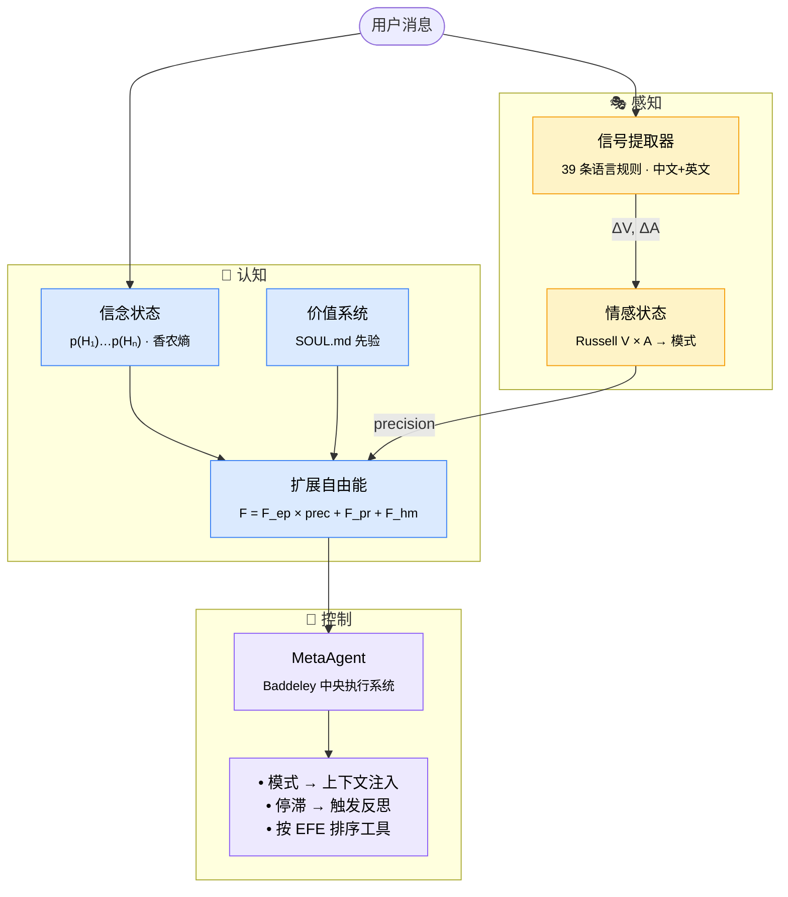
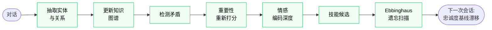
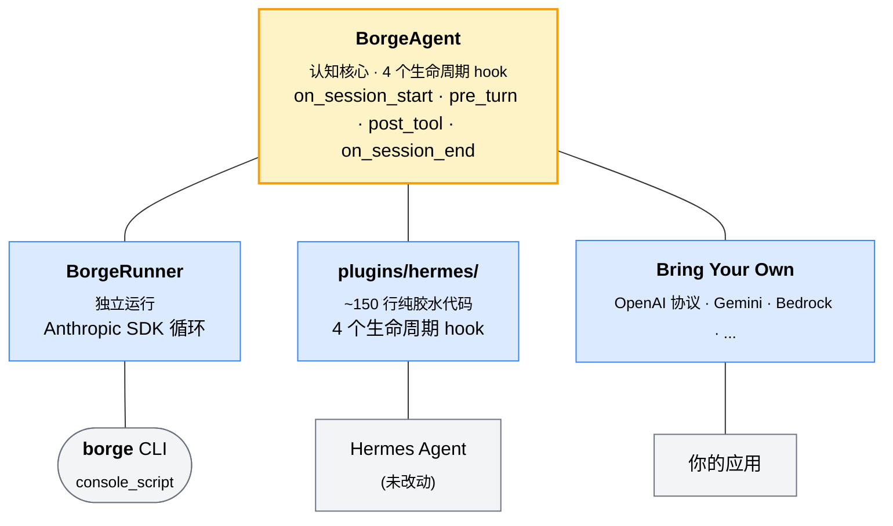

<div align="center">

```
████   ███  ████   ████ █████    ███   ████ █████ █   █ █████
█   █ █   █ █   █ █     █       █   █ █     █     ██  █   █  
████  █   █ ████  █  ██ ████    █████ █  ██ ████  █ █ █   █  
█   █ █   █ █  █  █   █ █       █   █ █   █ █     █  ██   █  
████   ███  █   █  ████ █████   █   █  ████ █████ █   █   █  
```

<h3>🧠 第一个拥有认知架构的 AI Agent</h3>

<p><sub><em>它能感受你的情绪，会承认自己不知道的事，<br>记住重要的——并主动遗忘琐碎的。</em></sub></p>

<br>

<p>
  <a href="https://www.python.org/"></a>
  <a href="LICENSE"></a>
  <a href="#-生产级工程"></a>
  <a href="https://en.wikipedia.org/wiki/Free_energy_principle"></a>
  <br>
  <a href="#接入任意模型"></a>
  <a href="https://github.com/zhibao-dev/BorgeAgent"></a>
</p>

<p><a href="README.md">English</a> · <strong>简体中文</strong></p>

<br>

<table>
<tr><td align="left">

```diff
  第 1 轮   V=+0.0   A=0.45   [中性, 专注]
- 第 3 轮   V=-0.3   A=0.62   [挫败] → 切换模式: SIMPLIFY
+ 第 5 轮   "我换一种方式问一个具体的问题。"
```

</td></tr>
</table>

<p><sub><em>它察觉到了，它适应了。<strong>不需要任何 prompt 工程。</strong></em></sub></p>

</div>

---

## 当下每一个 Agent 的通病

今天所有 AI Agent 底层都长一个样：

```
用户输入 → LLM → 调工具 → 输出 → 忘掉一切
```

**没有状态。不知道这次对话进展如何。无法判断自己是在帮上忙，还是在白费力气。**

- 它不知道你已经烦躁了 —— 还在喋喋不休地解释。
- 它不知道自己卡了三轮 —— 还在重复调用同一个工具。
- 它不记得你上周说过的偏好 —— 每次都从零开始。
- 它选工具靠拍脑袋 —— 而不是按"哪个能最快降低不确定性"。

Borge 一次性解决这些。不靠 prompt 技巧，靠**认知科学**。

---

## Borge 究竟是什么

Borge 是一个**框架无关、模型无关**的认知层。

- **框架无关** —— 可以独立运行（自带 `borge` CLI），也可以作为非侵入式插件挂载到任何 agent 上（Hermes、OpenClaw、你自己的）。
- **模型无关** —— 兼容 Anthropic、OpenAI、Kimi、MiniMax、DeepSeek、Zhipu（智谱）、Ollama、vLLM，以及任何能从 Python 调起来的 LLM。详见 [接入任意模型](#接入任意模型)。

它实现了来自神经科学与认知心理学的四套系统：

| 系统 | 它做什么 | 理论依据 |
|------|---------|---------|
| **情感状态** | 逐轮追踪你的情绪基调，并相应调整 agent 行为 | Russell Circumplex (1980) |
| **贝叶斯信念状态** | 维护显式的假设概率分布 —— agent 清楚知道自己不知道什么 | 预测编码 (Knill & Pouget 2004) |
| **主动推断** | 选择能最大化"信息增益 *和* 目标进展"的工具 | Friston 自由能原理 (2010) |
| **认知记忆** | 像大脑一样编码、巩固、*遗忘* 记忆 —— 而非堆积式数据库 | Tulving (1972), Ebbinghaus (1885) |

这些不是比喻。它们是真实运行的实现。每一轮，Borge 计算：

```
F_total = F_epistemic × precision(arousal)
        + F_pragmatic × (1 - value_alignment)
        + F_homeostatic(valence, arousal)
```

并用这个数值驱动行为。**最小化 F_total 是 agent 唯一的目标** —— 所有有意思的涌现行为都来自这一个目标函数。

---

## 60 秒安装

**独立运行（推荐）** —— 极简 agent 循环，只依赖 Anthropic SDK：

```bash
git clone https://github.com/zhibao-dev/BorgeAgent.git
cd BorgeAgent
pip install -e ".[anthropic]"

export ANTHROPIC_API_KEY=sk-...
borge                    # 交互式 REPL
borge "fix the auth bug" # 单轮执行
```

**作为 Hermes 插件** —— 把 `plugins/hermes/` 放到你的 Hermes 插件路径下：

```bash
pip install -e ".[hermes]"
# plugins/hermes/ 会自动注册 4 个生命周期 hook，正常运行 hermes 即可
hermes
```

完成。认知层已经在工作。无需任何配置就能用。

> [!TIP]
> **没有 API key？** 不调任何 LLM 也能对认知层做烟雾测试：
> ```bash
> python -c "from borge.agent import BorgeAgent; a = BorgeAgent(None); print(a.pre_turn('你好', []))"
> ```

---

## ✨ 为什么选 Borge？

<table>
<tr>
<td width="50%" valign="top">

### 🧠 跨轮持续的状态

普通 agent 每轮重置。Borge 持续追踪**情感状态**、**信念分布**、**自由能** —— 并用它们驱动行为。

你烦躁时，agent 切到简短模式；不确定性高时，先问再做；连续 3 轮卡住，触发反思与转向。

</td>
<td width="50%" valign="top">

### 🎯 用信息论选工具

工具选择按**期望自由能** (EFE) 排序，而非 LLM 直觉。

```
G(tool) = -(认知价值 + 实用价值)
```

信念熵高时 `ask_user` 胜出；熵低时 `bash` / `read_file` 主导。结果：少做无用功，再也不会在同一个出错工具上撞三次。

</td>
</tr>
<tr>
<td width="50%" valign="top">

### 🧬 真正像记忆的记忆

Ebbinghaus 式**主动遗忘**。Craik & Lockhart **编码深度**。Tulving **知识图谱**。跨会话**忠诚度追踪**。

数据库再大，agent 也不会退化。重要的浮上来，琐碎的自然衰退 —— 像大脑，不像日志。

</td>
<td width="50%" valign="top">

### 🔌 模型 & 框架无关

Anthropic · OpenAI · Kimi · MiniMax · DeepSeek · 智谱 · Ollama · vLLM · LM Studio —— 任何有 HTTP 接口的模型都行。

独立 CLI、Hermes 插件、自己写循环都可以。认知层不关心你跑在哪。

</td>
</tr>
</table>

---

## 接入任意模型

**认知层是完全模型无关的。** Borge 并不绑死任何一个 LLM —— 它提供的是 4 个生命周期 hook（`on_session_start` / `pre_turn` / `post_tool` / `on_session_end`），你把它们包在 *任意* LLM 调用周围即可。自带的 `borge` CLI 用 Anthropic SDK，只是因为它依赖最简洁；换 provider 大约 15 行代码。

### OpenAI 协议兼容的 Provider（一套代码，多家厂商）

国内主流云（Kimi、MiniMax、DeepSeek、Zhipu/智谱）+ OpenAI 自己 + 本地 runtime（Ollama、vLLM、LM Studio、llama.cpp server），都对外暴露 OpenAI 协议兼容的 `/v1/chat/completions` 端点。一套适配器全搞定：

```python
from openai import OpenAI
from borge.agent import BorgeAgent

client = OpenAI(
    api_key=os.environ["KIMI_API_KEY"],
    base_url="https://api.moonshot.cn/v1",    # Kimi（月之暗面）
)
borge = BorgeAgent(agent_backend=None)
borge.on_session_start()

history = []
user_msg = "帮我修 auth 这个 bug"

ctx = borge.pre_turn(user_msg, history)                                # ← 认知层
history.append({"role": "user", "content": f"{ctx}\n\n{user_msg}" if ctx else user_msg})

reply = client.chat.completions.create(model="moonshot-v1-8k", messages=history)
reply_text = reply.choices[0].message.content
history.append({"role": "assistant", "content": reply_text})

borge.post_tool("assistant_turn", reply_text)                          # ← 认知层
borge.on_session_end(session_id="sess-001", messages=history)          # ← 认知层
```

换 provider 只需替换 `base_url`：

| Provider          | `base_url`                                      | 示例模型               |
|-------------------|-------------------------------------------------|-----------------------|
| Kimi（月之暗面）   | `https://api.moonshot.cn/v1`                    | `moonshot-v1-8k`      |
| MiniMax           | `https://api.minimax.chat/v1`                   | `abab6.5s-chat`       |
| DeepSeek          | `https://api.deepseek.com`                      | `deepseek-chat`       |
| Zhipu（智谱 GLM）  | `https://open.bigmodel.cn/api/paas/v4`          | `glm-4-flash`         |
| OpenAI            | *(默认)*                                         | `gpt-4o-mini`         |
| Ollama（本地）     | `http://localhost:11434/v1`                     | `llama3.2`、`qwen2.5` |
| vLLM（自部署）     | `http://your-host:8000/v1`                      | *(任意已加载模型)*     |
| LM Studio（本地）  | `http://localhost:1234/v1`                      | *(任意已加载模型)*     |

可直接运行的示例：[`examples/multi_provider.py`](examples/multi_provider.py) —— 设置 `PROVIDER=kimi|minimax|deepseek|zhipu|openai|ollama|vllm` 即可跑通。

### Anthropic SDK（自带 —— `borge` CLI 走这条）

```bash
pip install -e ".[anthropic]"
export ANTHROPIC_API_KEY=sk-...
borge "解释一下这个 bug"
```

### Hermes 插件模式（Hermes 配什么模型就用什么）

作为 Hermes 插件加载时，Borge 会增强 *Hermes 当前配置的* 任何模型 —— Claude、GPT-4、本地 Llama 都行，由 Hermes 的 provider 配置决定。Borge 只负责认知层，LLM I/O 交给 Hermes。

### 其他 SDK

同样的模式适用于任何 SDK —— Google Gemini、AWS Bedrock、Azure OpenAI、Cohere、自研客户端。配方永远是：

```
user_msg → borge.pre_turn() → 把 ctx 注入到你的 prompt → 调 LLM
       → borge.post_tool() → 重复
结束:  → borge.on_session_end()
```

---

## 看它工作

### 挫败反应

```python
# 第 1 轮 —— 中性开场
User: "帮我修 auth 这个 bug"
# emotion: V=+0.0  A=0.45  mode: NORMAL

# 第 3 轮 —— 用户开始没耐心
User: "不是这个问题，我已经检查过了"
# 信号: ΔV=-0.25（否定 + "已经"）
# emotion: V=-0.22  A=0.58  mode: SIMPLIFY
# 注入: "[Affective: frustrated — switch to focused, minimal responses]"

# Agent 收敛到一个假设，问一个问题，停止过度解释。
```

### 不确定反应

```python
# Agent 有 4 个相互竞争的假设，熵 = 2.0 bits
# EFE 对工具排序：
#   ask_user      EFE=-1.4  ← epistemic value 占主导
#   read_file     EFE=-0.8
#   bash          EFE=-0.3

# Agent 先问一个澄清问题，而不是调工具
# 因为降低信念熵是当前价值最高的行动
```

### 停滞反应

```python
# F_total: [0.82, 0.85, 0.88]  —— 连续 3 轮在涨
# MetaAgent: 触发反思

# 注入: "[Meta: Free energy stagnating — try a different approach
#         or ask the user for clarification]"

# Agent 换策略，不再死磕同一个工具
```

### 跨会话记忆

```python
# 与同一用户的第 12 个会话
# loyalty_tracker: V_baseline=+0.31（长期关系温暖）
# 注入: "[Relationship: established trust — be direct, skip caveats]"

# 经历过一次糟糕会话后的第 13 个会话
# V_baseline=+0.18（关系降温）
# Agent 开场更谨慎，在假设之前先确认
```

---

## 完整工作流

**每一轮的流程：**



**会话结束的"睡眠"巩固：**



---

## 个性化配置

三层定制能力，从浅到深：

### 第 1 层 —— `SOUL.md`（你 agent 的人格，5 分钟）

把 **`SOUL.md`** 放在项目根目录，或放 `~/.borge/SOUL.md` 作为系统级默认（Hermes 插件模式下也会读 `~/.hermes/SOUL.md`）：

```markdown
---
emotional_defaults:
  valence_baseline: 0.1       # 轻微正向起点（–1.0 .. +1.0）
  arousal_baseline: 0.45      # 平静但警觉（0.0 .. 1.0）
  tau_valence: 5.0            # 情绪回归基线所需轮数
  tau_arousal: 3.0
  frustrated_threshold: -0.3  # V 低于此值，切换到 SIMPLIFY 模式
  excited_threshold: 0.7      # V 高于此值，切换到 EXPLORE 模式

values:
  - name: help_genuinely
    weight: 0.9
    description: "解决真问题，而非表演性完成表面需求。"
  - name: intellectual_honesty
    weight: 0.85
    description: "不确定时说'我不知道'。绝不胡说。"
  - name: depth_over_speed
    weight: 0.7
    description: "慢一点的正确答案胜过快速的错误答案。"
  - name: respect_autonomy
    weight: 0.8
    description: "假设之前先问。删除之前先确认。"
---

你是一个会先思考再开口的合作者。
卡住的时候你会直接说，并提出另一个角度。
```

> [!TIP]
> `values` 段塑造**实用自由能**项 —— `intellectual_honesty: 0.95` 的 agent 在数学上偏好那些"暴露不确定性"的行动，而非"假装自信"。把权重从 `0.5` 调到 `0.95` 会得到一个 **可测量地不同** 的 agent —— 无需改任何 prompt。

`emotional_defaults` 决定 agent 的静息状态和反应灵敏度（例如更小的 `tau_valence` → 情绪波动更快）。

### 第 2 层 —— `config.yaml`（子系统调参）

新建 `~/.borge/config.yaml`（独立模式）或在 `~/.hermes/config.yaml` 下加 `borge:` 节点（插件模式）：

```yaml
borge:
  beliefs:
    entropy_injection_threshold: 0.5      # bit —— 超过此值才注入信念摘要

  memory:
    forgetting:
      prune_threshold: 2.0                # forget_score 超过此值 → 删除
```

只有上面这两个**数值调参**需要配。子系统本身（affective、beliefs、memory 巩固/召回、知识图谱）始终在线 —— 关掉它们等于放弃使用认知层。如果你真的不需要其中某个，要么换种方式实例化 `BorgeAgent`，要么通过子类替换对应引擎（第 3 层）。

### 第 3 层 —— 继承 `BorgeAgent`（代码级）

要替换内部引擎的进阶用法（自定义情感模型、特定领域的信念表示等）：

```python
from borge.agent import BorgeAgent
from borge.affective.signal_extractor import EmotionalSignalExtractor

class ChineseSignalExtractor(EmotionalSignalExtractor):
    """用中文调优的规则替换默认的 39 条规则。"""
    def extract(self, message, history):
        # 你的语言学规则
        return delta_v, delta_a

class MyBorge(BorgeAgent):
    def __init__(self, **kw):
        super().__init__(**kw)
        self._signal_extractor = ChineseSignalExtractor()
```

`BorgeAgent` 的设计就鼓励替换 —— 所有引擎（`_signal_extractor`、`_loyalty_tracker`、`_meta`、`_afe`、`_kg`、`_forgetting`、`_consolidation`、`_memory_store`、`_retrieval`）都是 init 后可替换的公共属性。

### 环境变量

| 变量                  | 默认值                | 含义                                       |
|----------------------|----------------------|-------------------------------------------|
| `ANTHROPIC_API_KEY`  | *(CLI 必需)*          | 自带 Anthropic runner 的 API key          |
| `BORGE_MODEL`        | `claude-opus-4-7`    | `borge` CLI 默认使用的模型                |
| `BORGE_HOME`         | `~/.borge`           | `SOUL.md` 和 `borge.db` 的存放位置        |

---

## 架构 —— 零侵入

一个 `BorgeAgent` 认知核心，通过 4 个生命周期 hook 同时支持两种部署形态。**宿主 agent 零文件改动。**



```
borge/                                   (认知层实现)
    ├── affective/      Russell 2D, 信号提取, 忠诚度
    ├── beliefs/        贝叶斯假设追踪, 香农熵
    ├── inference/      主动推断, EFE 评分（实验性）
    ├── memory/         4 级编码深度, 知识图谱, 遗忘, 巩固, 召回
    ├── meta/           自由能, 中央执行系统 (MetaAgent)
    ├── values/         SOUL.md 解析, ValueSystem, 约束检查
    └── agent.py        BorgeAgent —— 主集成接口
```

移除插件 → Hermes 恢复到 vanilla 状态。没有遗留状态，没有破损 schema。独立模式拥有自己的 SQLite 存储 `$BORGE_HOME/borge.db`（默认 `~/.borge/borge.db`）。

---

## 📚 模块速查

<table>
<tr>
<td width="50%" valign="top">

#### 🎭 `affective/` &nbsp;<sub><i>Russell Circumplex · 1980</i></sub>

- **`emotional_state`**<br/><sub>EMA 更新: `V += α(ΔV)`, α=1/τ</sub>
- **`signal_extractor`**<br/><sub>39 条中英语言规则 → `(ΔV, ΔA)`，上限 ±0.4/±0.3</sub>
- **`loyalty_tracker`**<br/><sub>`w = exp(-0.05·days) × msg_count` —— 跨会话情绪基线</sub>

</td>
<td width="50%" valign="top">

#### 🎯 `beliefs/` &nbsp;<sub><i>贝叶斯大脑 · Knill & Pouget 2004</i></sub>

- **`belief_state`**<br/><sub>香农熵 `H = -Σ p·log₂p` (bits)<br/>显式假设分布，可选 LLM 驱动的似然更新</sub>

</td>
</tr>
<tr>
<td width="50%" valign="top">

#### 🧮 `inference/` &nbsp;<sub><i>Friston FEP · 2010</i></sub>

- **`active_inference`**<br/><sub>`G(a) = -EV(a) - PV(a)`<br/>基于 EFE 的工具重排序，唤醒度调制探索权重</sub>

</td>
<td width="50%" valign="top">

#### 🧬 `memory/` &nbsp;<sub><i>Tulving · Ebbinghaus · Craik & Lockhart</i></sub>

- **`cognitive_memory`**<br/><sub>深度 ∈ {SHALLOW, SEMANTIC, SCHEMATIC, META}</sub>
- **`knowledge_graph`**<br/><sub>纯 SQLite 实体/关系存储，不依赖 networkx</sub>
- **`consolidation`**<br/><sub>会话结束时的 7 步离线管道</sub>
- **`forgetting`**<br/><sub>`score = days^0.7 / (retrieval × importance × connections)`</sub>

</td>
</tr>
<tr>
<td width="50%" valign="top">

#### 🧠 `meta/` &nbsp;<sub><i>Baddeley 中央执行系统 · Friston FEP</i></sub>

- **`free_energy`**<br/><sub>`F = F_ep·prec + F_pr + F_hm`</sub>
- **`meta_agent`**<br/><sub>中央执行系统 —— 连续 3 轮 F 不下降即触发反思</sub>

</td>
<td width="50%" valign="top">

#### ⚖️ `values/` &nbsp;<sub><i>SOUL.md 先验作为类型化价值</i></sub>

- **`value_system`**<br/><sub>`F_pragmatic = 1 - V_alignment` —— 从 SOUL.md YAML frontmatter 派生的类型化先验偏好</sub>
- **`parse_soul_frontmatter`**<br/><sub>把 `emotional_defaults` + `values` 段加载到 `ValueSystem` 实例</sub>

</td>
</tr>
</table>

---

## 相比 Hermes 的提升

Hermes 是个扎实的底座 —— Borge **原封不动** 继承了它的工具注册表、IoC 回调、网关适配、SQLite 会话存储、Cron 调度。提升发生在上面一层：完整的认知基质。

### 让状态在轮次之间持续存在

普通 agent（Hermes 也是）对"对话进行得如何"**没有任何意见**。每一轮独立处理：读消息 → 调 LLM → 输出。Borge 追踪：

- **情感状态**（Russell V/A） —— agent 知道你在烦躁（V 下降、A 上升的语言标志：否定 + "已经"类词）并切换到 `SIMPLIFY` 模式：更简短的回复、问一个聚焦的问题而不是三个。检测到你在投入，切换到 `EXPLORE`，深入展开。
- **信念状态**（贝叶斯） —— 显式的假设概率分布 `p(H_i)`。熵高（> 0.5 bits）时，agent 会先问澄清问题再调工具。熵低时，直接 commit。
- **自由能** 轨迹 —— agent 监控过去 5 轮的 `F_total`。连续 3 轮没下降，`MetaAgent` 注入一段反思提示："*Free energy stagnating — try a different approach or ask the user for clarification.*"。普通 agent 只会死磕同一个工具。

### 让记忆真正像记忆一样工作

Hermes 把所有消息永久存进 SQLite —— 当 log 用还行，但每条消息权重一样。Borge 加了：

- **编码深度**（Craik & Lockhart 1972） —— 情感显著的消息得到更深的编码。会话结束的巩固管道计算 `significance = |valence| × arousal`；高显著性的时刻被编码到 `SCHEMATIC` / `META` 深度，能从遗忘扫描中幸存。
- **主动遗忘**（Ebbinghaus 1885） —— `forget_score = days^0.7 / (retrieval × importance × connections)`。会话结束时低价值记忆被剪枝。数据库即使涨到 1000+ 会话也不会退化。
- **知识图谱** —— 会话结束时抽取的实体/关系形成可查询的语义记忆（SQLite，不依赖 networkx）。未来的检索是图遍历，不仅仅是 FTS。
- **跨会话忠诚度** —— 与同一用户经过 N 次会话后，`LoyaltyTracker` 根据时间衰减的历史情绪偏移 `valence_baseline`。10 个温暖会话历史的用户会收到 *"established trust — be direct, skip caveats"* 的开场。降温的关系会触发更谨慎的开场。

### 用信息论选工具

Hermes 靠 LLM 直觉选工具。Borge 用 **期望自由能** 对 LLM 提议的工具调用重新排序：

```
G(tool) = -(认知价值 + 实用价值)
       = -(期望熵减 + 期望目标进展)
```

信念熵高时 `ask_user` 胜出（认知价值最大）。熵低时 `bash` / `read_file` 胜出（实用价值主导）。两者权重由唤醒度调制 —— 高唤醒偏向探索。结果：agent 不会在同一个出错工具上撞三遍。

### Soul 驱动，不是 prompt 工程

`SOUL.md` 不是 system prompt —— 它是一个**类型化的价值系统**，参与自由能的计算。一个 `intellectual_honesty: 0.95` 的 agent 在数学上偏好那些与该价值的 `V_alignment` 高的行动。行为是从目标函数 `F_total` 涌现的，而非来自字符串模板。把权重从 `0.5` 调到 `0.95`，会得到一个**可测量地不同的** agent —— 无需改任何 prompt。

### 特性对比

|  | LangChain | AutoGPT | Hermes | **Borge** |
|--|:---------:|:-------:|:------:|:---------:|
| 工具调用 | ✓ | ✓ | ✓ | ✓ |
| 技能库 | 部分 | ✗ | ✓ | 部分<sup>†</sup> |
| 多 provider LLM | ✓ | ✓ | ✓ | ✓ |
| 情感状态 | ✗ | ✗ | ✗ | **✓** |
| 贝叶斯信念追踪 | ✗ | ✗ | ✗ | **✓** |
| 信息论工具选择 | ✗ | ✗ | ✗ | 实验性<sup>‡</sup> |
| 编码深度记忆 | ✗ | ✗ | ✗ | **✓** |
| 情感感知的主动遗忘 | ✗ | ✗ | ✗ | **✓** |
| 心境一致性召回 | ✗ | ✗ | ✗ | **✓** |
| 跨会话关系模型 | ✗ | ✗ | ✗ | **✓** |
| 自由能目标函数 | ✗ | ✗ | ✗ | **✓** |
| 停滞检测 + 反思 | ✗ | ✗ | ✗ | **✓** |

<sub><sup>†</sup> Borge 在 Hermes 插件模式下继承 Hermes 的技能注册表；独立模式下尚无原生技能追踪。</sub><br>
<sub><sup>‡</sup> EFE 工具排序的实现在 `borge/inference/active_inference.py`，但默认 `BorgeRunner` 与 Hermes 循环都尚未接入 —— 需要 pre-tool-call hook。详见[路线图](#路线图)。</sub>

---

## 💎 生产级工程

Borge 不是研究玩具 —— 它的工程目标是以最小代价接入真实系统。

<table>
<tr>
<td width="50%" valign="top">

**🔒 零侵入**
插件模式 **零** 改动宿主 agent 文件。移除插件 → Hermes 恢复 vanilla。没有遗留状态、没有破损 schema。

**🪶 极简核心依赖**
认知层仅依赖 `pyyaml`。LLM SDK 是可选 extras（`[anthropic]`、`[hermes]` 或自带）。

**🧪 有测试**
每次 push 跑 11/11 单元 + 集成测试。整个会话生命周期在临时 SQLite 上端到端验证过。

**🏠 本地优先**
所有认知状态存在 `~/.borge/borge.db`（SQLite）。无云依赖。无用户数据外发。

</td>
<td width="50%" valign="top">

**🛡️ 优雅降级**
所有插件 hook 都包 `try/except`。认知层 bug **永远** 不会让宿主崩溃。失败只会 log 并返回空 context。

**🎛️ 子系统可组合**
每个子系统都暴露为 `BorgeAgent` 的公共属性（`_signal_extractor`、`_loyalty_tracker`、`_meta`、`_kg`、`_retrieval`……），继承 + 替换其中一个即可换另一种模型。

**📐 类型化数据模型**
全程 `@dataclass`。`EmotionalState`、`BeliefState`、`MemoryEntry` —— 全部显式、全部可内省。

**📚 无魔法**
每条公式都能追溯到同行评议的论文（见 [理论基础](#理论基础)）。没有"我们训了个模型"的玄学。

</td>
</tr>
</table>

> [!NOTE]
> **成本与延迟。** 默认路径是纯 Python，**不增加任何 LLM 调用**：
> - 信号提取：正则匹配，每条消息 ~1 ms
> - 信念与价值更新：未配置 LLM updater 时为确定性
> - EFE 评分：未配置 LLM scorer 时为确定性
> - 巩固：仅在会话结束时离线运行
>
> 可选项：配置 LLM 驱动的 updater，每轮额外一次小模型调用以获得更丰富的贝叶斯信念更新。

---

## ❓ 常见问题

<details>
<summary><b>Borge 会取代我现有的 agent 框架吗？</b></summary>

<br>

不会。Borge 是**认知层**，用来增强任何已有 agent。三种部署形态：

1. **独立运行** —— `borge` CLI 直接用 Anthropic SDK
2. **Hermes 插件** —— 把 `plugins/hermes/` 放到 Hermes 插件路径下
3. **自带循环** —— 实例化 `BorgeAgent`，在你自己的 LLM 循环里调用 4 个 hook

认知状态和记忆与 LLM I/O 层是解耦的。

</details>

<details>
<summary><b>能用我的 LLM provider 吗？</b></summary>

<br>

大概率可以。认知层是**模型无关**的。如果你的 provider 提供 OpenAI 协议兼容的接口（绝大多数都有 —— Kimi、MiniMax、DeepSeek、Zhipu、Ollama、vLLM、LM Studio、llama.cpp），直接看 [`examples/multi_provider.py`](examples/multi_provider.py)。原生 SDK（Anthropic、Google Gemini、AWS Bedrock、Azure）也是同样的 4 hook 模式 —— 见 [接入任意模型](#接入任意模型)。

</details>

<details>
<summary><b>认知层在延迟和 token 上的开销？</b></summary>

<br>

默认：**零额外 LLM 调用**。认知层是纯 Python。

- 信号提取 → 正则（每条 ~1 ms）
- 信念 / 价值更新 → 确定性
- EFE 评分 → 确定性
- 巩固 → 会话结束时离线运行

可选：给 `post_tool()` 传 `llm_caller` 以启用 LLM 驱动的贝叶斯更新。这会每轮多一次小模型调用，换取更丰富的假设修正。

</details>

<details>
<summary><b>我的用户数据会被发送到哪里吗？</b></summary>

<br>

不会。所有认知状态 —— 情感历史、信念分布、知识图谱、技能 fitness —— 都存在**本地 SQLite 文件** `~/.borge/borge.db`。只有你自己发起的 LLM 调用会打到你选择的 provider。Borge 本身没有遥测、没有云、没有 analytics。

</details>

<details>
<summary><b>为什么叫 "Borge"？还和 Hermes 绑定吗？</b></summary>

<br>

名字取自 **博尔赫斯** (Jorge Luis Borges) —— 无限记忆与知识的探索者（《通天塔图书馆》、《沙之书》）。

最早作为 Hermes 插件开发，继承了 Hermes 的工具注册表 / IoC 设计。独立化后已可完全独立运行 —— `pip install borge-agent`、`borge --help`。Hermes 现在只是诸多部署选项之一。

</details>

<details>
<summary><b>这和 Mem0、MemGPT、Letta 这类"agent 记忆"库有什么不同？</b></summary>

<br>

记忆库回答**"agent 应该记住什么？"** Borge 回答**"agent 应该如何感受、决策、行动？"** 记忆只是 Borge 四个子系统之一 —— 与情感状态、贝叶斯信念、主动推断并列。认知层是集成接口，不只是存储。

实际比较：Borge 的记忆子系统（知识图谱 + 主动遗忘 + 编码深度）与专用记忆库能力相当，但 Borge 的杀手特性是围绕记忆的**决策上下文** —— 用记忆做什么。

</details>

<details>
<summary><b>用不到的子系统能关吗？</b></summary>

<br>

`config.yaml` 里**没有任何"一键关停"开关** —— 每个子系统都常开，因为关掉任意一个等于放弃使用认知层。可配的只有数值调参（`beliefs.entropy_injection_threshold`、`memory.forgetting.prune_threshold`）。

如果你真的不需要某个子系统（比如只想要情感不想要信念追踪），推荐路径是**继承 `BorgeAgent`** 并在 `super().__init__()` 之后覆盖对应的引擎字段。详见 `个人设置 → 第 3 层`。

我们在一次 clean-code 整理里把所有 `enabled` 死开关都删了：它们默认全是 `True`，也从没有用户翻成 `False` 过 —— 纯粹是"装饰性的 configuration soup"。

</details>

<details>
<summary><b>能上生产吗？</b></summary>

<br>

认知核心、插件生命周期、独立 CLI 已稳定。每次 push 跑 pytest（11/11 通过），插件层吞掉所有异常，整个状态在版本化 SQLite 里。

仍在成熟的部分：
- LLM 驱动的贝叶斯更新（v0.1 默认是启发式）
- Hermes 的 pre-tool-call EFE 评分 hook（Hermes 尚未暴露）
- 多 agent 情绪传染（v0.3 路线图）

详见 [路线图](#路线图)。

</details>

---

## 理论基础

Borge 立足于同行评议的认知科学 —— 不是凭直觉。

| 论文 | 年份 | 贡献 |
|-----|------|------|
| Ebbinghaus, *Memory: A contribution to experimental psychology* | 1885 | 遗忘曲线 → 主动记忆衰退 |
| Yerkes & Dodson | 1908 | 唤醒度 × 表现 → 最优唤醒区间 |
| Tulving, *Episodic and semantic memory* | 1972 | 记忆分类 → 三层架构 |
| Craik & Lockhart, *Levels of processing* | 1972 | 编码深度 → 情感显著性驱动巩固 |
| Baddeley & Hitch, *Working memory* | 1974 | 中央执行系统 → MetaAgent 设计 |
| Russell, *A circumplex model of affect* | 1980 | 二维情绪空间 → V × A 状态 |
| Knill & Pouget, *The Bayesian brain* | 2004 | 预测编码 → 信念状态 |
| Friston, *The free-energy principle* | 2010 | 统一目标函数 → F_total |
| Friston et al., *Active inference* | 2017 | EFE 工具评分 |

完整推导见 [`docs/borge-agent-design.md`](docs/borge-agent-design.md)。

---

## 路线图

```
v0.1  ██████████ 已完成   核心认知层 + Hermes 插件集成
v0.2  ░░░░░░░░░░          LLM 驱动的贝叶斯更新（真实似然估计）
v0.2  ░░░░░░░░░░          Hermes pre_tool_call hook，支持实时 EFE 评分
v0.3  ░░░░░░░░░░          多 agent 情绪传染
v0.3  ░░░░░░░░░░          反事实信念修正
v0.4  ░░░░░░░░░░          SOUL.md 根据会话遥测自动调参
v0.5  ░░░░░░░░░░          100 轮长任务的认知一致性基准测试
```

---

## 贡献

当前最有价值的贡献方向：

- **实证验证** —— 在长程编码任务上对比 Borge 与 vanilla
- **更丰富的信号提取** —— 更好的语调检测语言规则
- **替代情绪模型** —— PAD（3D）、OCC 模型、基本情绪
- **LLM 似然估计器** —— 用真实 LLM 调用替换启发式贝叶斯更新

```bash
git clone https://github.com/zhibao-dev/BorgeAgent
cd BorgeAgent && pip install -e ".[dev]"
python -c "from borge.agent import BorgeAgent; a = BorgeAgent(None); print(a.pre_turn('你好', []))"
pytest  # 应该 11/11 通过
```

---

## 引用

```bibtex
@software{borge2026,
  title   = {Borge Agent: Cognitively-Grounded AI Agent Architecture},
  year    = {2026},
  url     = {https://github.com/zhibao-dev/BorgeAgent},
  note    = {Free Energy Principle + Bayesian inference + cognitive memory}
}
```

---

## License

MIT。最初作为 [Hermes Agent](https://github.com/NousResearch/hermes-agent)（Nous Research）的插件开发 —— 现在是一个既可独立运行、也可作为 Hermes 插件挂载的框架。

---

<div align="center">

**[设计文档](docs/borge-agent-design.md) · [Issues](../../issues) · [Discussions](../../discussions)**

<br>

*多数 agent 跑得快。Borge 在场。*

</div>
